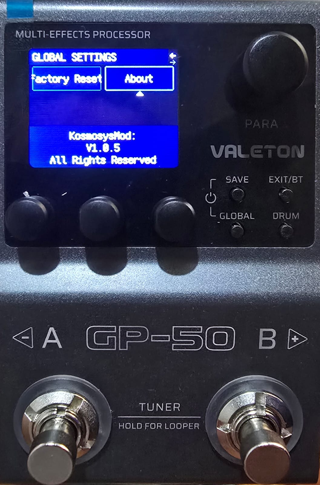

# GP-50 PatchToEnglish



Translates the Valeton GP-50 guitar processor firmware from Chinese to English.

## What This Tool Does

This script replaces Chinese text strings in the GP-50 firmware with English translations while preserving the original byte structure and boundaries. It performs surgical string replacement in the firmware's string table section.

## Requirements

- **Original GP-50 Firmware V1.0.5** (must be obtained legally)
- Windows PowerShell 5.1+ or PowerShell Core 7+
- A computer to run the patching script

### Where to Get the Original Firmware

Download the original V1.0.5 firmware from Valeton's official website:
https://www.valeton.net/pages/download

Or search for "Valeton GP-50 firmware download" on your preferred search engine.

## Disclaimer - IMPORTANT

**By using this software, you agree to the following terms:**

1. **Right to Repair**: This tool is intended to support the right to repair and firmware modification for educational purposes.

2. **No Firmware Distribution**: We do not distribute the firmware itself. You must obtain the original firmware legally from Valeton.

3. **Warranty Void**: Flashing a custom-modified firmware will void your device's warranty. Proceed at your own risk.

4. **No Liability**: The authors and contributors of this project are NOT responsible or liable for:
   - Any damage to your device
   - Bricked firmware
   - Loss of functionality
   - Any other issues arising from the use of this tool

5. **Use at Your Own Risk**: Modifying firmware can permanently damage your device. You accept all risks associated with this process.

6. **License**: This script is licensed under the [GNU General Public License v3 (GPLv3)](LICENSE).

7. **Firmware Updates Will Overwrite Translation**: If you update your GP-50 firmware in the future (e.g., to a newer version from Valeton), the English translation will be lost. You will need to re-patch the new firmware using this tool if you want to restore English text.

## Installation

1. Download the original GP-50 V1.0.5 firmware from Valeton's website
2. Copy the firmware file to the same folder as this script
3. Run the patcher script

## Usage

### Basic Usage

```powershell
.\GP-50-PatchToEnglish-v5.ps1 -input "GP-50 Firmware V1.0.5.bin"
```

### Options

| Option | Description |
|--------|-------------|
| `-input <file>` | Path to your original firmware file (required) |
| `-output <file>` | Output firmware file (default: auto-generated) |
| `-r <start> <end>` | Custom hex region to patch (default: 0x165840 0x166000) |
| `--force-patch` | Skip version validation (use with caution!) |
| `--help` | Show brief help |
| `--man` | Show detailed manual |

### Examples

```powershell
# Basic patching
.\GP-50-PatchToEnglish-v5.ps1 -input "GP-50 Firmware V1.0.5.bin"

# With output file
.\GP-50-PatchToEnglish-v5.ps1 -input firm.bin -output patchfirm.bin

# Force patch (skip version check)
.\GP-50-PatchToEnglish-v5.ps1 -input "firmware.bin" --force-patch

# Custom region
.\GP-50-PatchToEnglish-v5.ps1 -input "firmware.bin" -r 0x165840 0x166000

# Show help
.\GP-50-PatchToEnglish-v5.ps1 --help
```

## Output

The script creates a folder named **"GP-50 to English"** containing:
- Patched firmware file with name: `<original>-PatchedToEnglish-v5.bin`

## How It Works

1. **Version Check**: Validates firmware is V1.0.5 by checking for "V105" at offset 0x90
2. **String Scanning**: Locates all UTF-8 encoded Chinese strings in the specified region
3. **Dynamic Replacement**: Replaces each Chinese string with English while:
   - Using dynamic length calculation (based on next string position)
   - Preserving null-byte padding
   - Maintaining original byte boundaries
4. **Output**: Saves patched firmware with descriptive filename

## Troubleshooting

### "This firmware is not V1.0.5"

Your firmware version doesn't match V1.0.5. Use `--force-patch` at your own risk, or obtain the correct version.

### File Not Found

Make sure the firmware file is in the same directory as the script, or provide full path.

### Script Execution Policy

If you get execution policy errors, run:
```powershell
Set-ExecutionPolicy -RemoteSigned -Scope CurrentUser
```

Or run with bypass:
```powershell
powershell -ExecutionPolicy Bypass -File "GP-50-PatchToEnglish-v5.ps1" -input "firmware.bin"
```

## Support

This is an open-source project. For issues and updates, visit the project repository.

## What is a computer?

If you're not familiar with command-line tools:

1. Place your firmware file (e.g., `GP-50 Firmware V1.0.5.bin`) in the same folder as this script
2. Right-click the folder and select "Open Windows PowerShell"
3. Type: `.\GP-50-PatchToEnglish-v5.ps1 -input "GP-50 Firmware V1.0.5.bin"`
4. Press Enter
5. Look in the folder for your patched file

---

## How to Flash the Patched Firmware

For detailed instructions on how to flash firmware to your GP-50 using Valeton's official software, please refer to this official Valeton tutorial:

**[Valeton GP-200 Series Firmware Update Tutorial](https://www.youtube.com/watch?v=BXEqpVEbuQk)**

The process is identical for the GP-50:
1. Download the latest Valeton GP-50 software from https://www.valeton.net/pages/download
2. Connect your GP-50 via USB
3. Open the Valeton software and follow the firmware update wizard
4. Select the patched firmware file when prompted

### Quick Summary
- Connect GP-50 via USB and power it on
- Open Valeton software on your computer
- Go to the firmware update section
- Select the patched firmware file
- Wait for the update to complete

---

**Remember: Modifying firmware can damage your device. You assume all responsibility for any damage or issues.**
